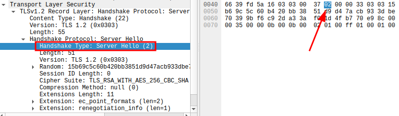

# Decrypt TLS Record Layer

Used cipher suite: `TLS_RSA_WITH_AES_256_CBC_SHA`  
Captured Handshake: [handshake.pcapng](./handshake.pcapng)

### Extract keys from key block

Key block:
```text
C6 30 75 0C EA 9C 2C 8B 3C FF 30 F9 0B CB E0 3E
00 D9 1F A2 94 9A 04 5E 22 5C F9 5B 29 FA 57 17
9C B5 A2 C4 00 E2 89 EC 9C 0E 2D DC E5 60 99 F5
54 D8 6E 84 09 99 59 EC BA 65 55 B8 E8 9A 82 DB
83 C9 21 07 DB 33 69 E1 CE 73 27 38 D7 81 02 69
DC 92 43 8A 3E 20 B7 A2 85 51 3A FD ED 34 27 BD
03 7E 69 16 FB 18 A4 FA
```
* client\_write\_mac\_key: `C630750CEA9C2C8B3CFF30F90BCBE03E00D91FA2` (20)
* server\_write\_mac\_key: `949A045E225CF95B29FA57179CB5A2C400E289EC` (20)
* client\_write\_key: `9C0E2DDCE56099F554D86E84099959ECBA6555B8E89A82DB83C92107DB3369E1` (32)
* server\_write\_key: `CE732738D7810269DC92438A3E20B7A285513AFDED3427BD037E6916FB18A4FA` (32)


### Extract IV and cipher text

TLSv1.2 Record Layer: Handshake Protocol: Encrypted Handshake Message
```text
0000   16 03 03 00 40 0e e1 bc 7e c3 ef 29 7a 9c cb 45
0010   6f 21 49 e0 11 b9 b6 f1 f3 9a 5f 85 1e 62 d0 77
0020   c8 3d 17 81 ec 02 f6 a5 25 47 84 a8 f9 4b 4a 3d
0030   67 1a 5e 45 4f 60 bc 93 52 37 74 b2 6c 21 92 8c
0040   52 86 fd 4a 97
```

Structure of record layer: `Record Header || IV || Enc(DATA || MAC || PADDING)`
* Record Header
  * Content Type: `16`
  * Version: `03 03`
  * Length: `00 40`
* IV: `0ee1bc7ec3ef297a9ccb456f2149e011`
* Encrypted Handshake Message: `b9b6f1f39a5f851e62d077c83d1781ec02f6a5254784a8f94b4a3d671a5e454f60bc93523774b26c21928c5286fd4a97`
```text
0000   b9 b6 f1 f3 9a 5f 85 1e 62 d0 77 c8 3d 17 81 ec
0010   02 f6 a5 25 47 84 a8 f9 4b 4a 3d 67 1a 5e 45 4f
0020   60 bc 93 52 37 74 b2 6c 21 92 8c 52 86 fd 4a 97
```

### Decrypt record layer

Decrypt cipher text with openssl
```bash
$ echo -ne '\x00\x11\x22..<encrypted message>' | openssl enc -nopad -d <cipher> -K <key in hex> -iv <iv in hex>
# or
$ openssl enc -nopad -d <cipher> -K <key in hex> -iv <iv in hex> -in <encrypted message file>
```

List available ciphers
```bash
$ openssl enc -ciphers
```

Decrypt record layer
```bash
echo -ne '\xb9\xb6\xf1\xf3\x9a\x5f\x85\x1e\x62\xd0\x77\xc8\x3d\x17\x81\xec\x02\xf6\xa5\x25\x47\x84\xa8\xf9\x4b\x4a\x3d\x67\x1a\x5e\x45\x4f\x60\xbc\x93\x52\x37\x74\xb2\x6c\x21\x92\x8c\x52\x86\xfd\x4a\x97' \
| openssl enc -nopad -d -aes-256-cbc \
-K 9c0e2ddce56099f554d86e84099959ecba6555b8e89a82db83c92107db3369e1 \
-iv 0ee1bc7ec3ef297a9ccb456f2149e011 | xxd

00000000: 1400 000c 2d6e 6c3e 0a64 1f61 0e42 aa5a  ....-nl>.d.a.B.Z
00000010: 0a5c 2a78 70ff 3799 b89d f1c4 65f8 a85e  .\*xp.7.....e..^
00000020: 3c3d 9a96 0b0b 0b0b 0b0b 0b0b 0b0b 0b0b  <=..............
```

Decrypted record layer: `1400000c2d6e6c3e0a641f610e42aa5a0a5c2a7870ff3799b89df1c465f8a85e3c3d9a960b0b0b0b0b0b0b0b0b0b0b0b`

### Determine padding bytes

See: https://github.com/tls-attacker/TLS-Padding-Oracles/issues/5
> in TLS the last padding byte is equal to the number of the remaining padding bytes

So `0b` means 11 padding bytes remaining. Padding: `0b0b0b0b0b0b0b0b0b0b0b0b`

### Determine length of MAC

The hash function used to calculate the MAC is SHA(-1) according to the cipher suite: `TLS_RSA_WITH_AES_256_CBC_SHA`.  
According to [RFC 5246](https://www.ietf.org/rfc/rfc5246.txt) the length of the MAC should be 20 bytes:
```
MAC       Algorithm    mac_length  mac_key_length
--------  -----------  ----------  --------------
NULL      N/A              0             0
MD5       HMAC-MD5        16            16
SHA       HMAC-SHA1       20            20      <--
SHA256    HMAC-SHA256     32            32
```

MAC: `0a5c2a7870ff3799b89df1c465f8a85e3c3d9a96`

### Analyze decrypted plaintext

The format of the record layer is: `Enc(DATA || MAC || PADDING)`  
When we eliminate MAC + PADDING the decrypted plaintext data is: `1400000c2d6e6c3e0a641f610e42aa5a`  
It represents a handshake message (the client finished message).

Inside a record layer each handshake message begins with a `Handshake type`. In that case it is `0x14` = `20` = `finished`.  
See: https://www.iana.org/assignments/tls-parameters/tls-parameters.xhtml#tls-parameters-7



### Extract verify\_data from decrypted client finished message

Structure of client finished message:
* Handshake Type: `14` (1)
* Length of verify\_data: `00 00 0c` (3)
* verify\_data: `2d6e6c3e0a641f610e42aa5a` (12)


### Decrypt application data

Encrypted application data: `4bf0b54023c29b624de9ef9c2f931efc16cebe24016e72c1c923898e5f87f161dd663c08c3ba2ad9df837231d2ea054a076c136edaec8abef45750f67d7c2575e294ef29173b8072d6c35b095dc2f0ea758bff2425e57b00ae7236ad16bade9e`

IV: `4bf0b54023c29b624de9ef9c2f931efc`  
Cipher text: `16cebe24016e72c1c923898e5f87f161dd663c08c3ba2ad9df837231d2ea054a076c136edaec8abef45750f67d7c2575e294ef29173b8072d6c35b095dc2f0ea758bff2425e57b00ae7236ad16bade9e`

The message was sent from server to client so we need the `server\_write\_key`.

```bash
echo -ne '\x16\xce\xbe\x24\x01\x6e\x72\xc1\xc9\x23\x89\x8e\x5f\x87\xf1\x61\xdd\x66\x3c\x08\xc3\xba\x2a\xd9\xdf\x83\x72\x31\xd2\xea\x05\x4a\x07\x6c\x13\x6e\xda\xec\x8a\xbe\xf4\x57\x50\xf6\x7d\x7c\x25\x75\xe2\x94\xef\x29\x17\x3b\x80\x72\xd6\xc3\x5b\x09\x5d\xc2\xf0\xea\x75\x8b\xff\x24\x25\xe5\x7b\x00\xae\x72\x36\xad\x16\xba\xde\x9e' | openssl enc -nopad -d -aes-256-cbc -K ce732738d7810269dc92438a3e20b7a285513afded3427bd037e6916fb18a4fa -iv 4bf0b54023c29b624de9ef9c2f931efc
A pirate I was meant to be, trim the sails and roam the seaI{
7S?rz0`%
```
